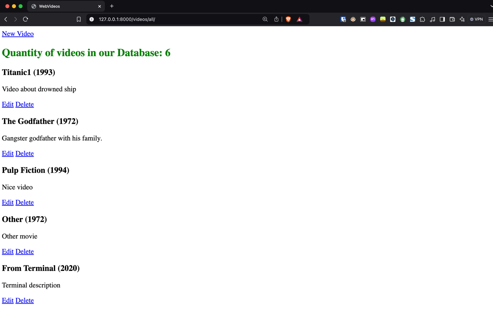

# Filmweb Clone (Django)

This is a project to create a clone of the popular website [Filmweb](https://www.filmweb.pl/) using Django. The platform is for browsing movies, TV shows  and providing ratings and reviews.

## Project Overview

The goal of this project is to replicate the core functionality of Filmweb, including:

- **Movie/TV Show Browsing**: Users can explore a vast collection of movies, TV shows, and actors.
- **Detailed Pages**: Each movie and TV show has a detailed page with information like cast, ratings, reviews, and related content.
- **Rating and Reviews**: Users can rate movies and leave reviews.
- **Search**: A search feature allows users to find movies, TV shows, actors, and directors.
- **Recommendations**: Users get movie recommendations based on their preferences.

## Current Features

At this stage, the following functionality has been implemented:

- **CRUD functionality for Video objects**:  
  - Users can **create**, **read**, **update**, and **delete** Video objects in the database.
  - Each `Video` object stores the following information:
    - **Title**: A unique title (max length 64 characters)
    - **Description**: A detailed description of the video
    - **Year**: The release year (default is 2000)
    - **Premiere Date**: The movie's premiere date
    - **IMDb Rating**: The IMDb rating (optional, with two decimal places)
    - **Poster**: An image of the movie poster (optional)
  - The `Video` model has a method to return the title with the year, e.g., *"Movie Title (2025)"*.

- **Basic Frontend**:
  - Simple templates are created to display Video objects in the frontend.
  - Users can interact with the CRUD features through the interface, with the ability to view, add, edit, and delete videos.

### Preview : 
Main page: 


Video Model :


## ⚠️ Project Status ⚠️
This project is **still in progress**. While the core CRUD functionality for Video objects is implemented, there are several features planned for future development, including user authentication, movie ratings and reviews, recommendations, and more advanced search options.

Stay tuned for updates!
## Technologies Used

- **Backend**: Django
- **Frontend**: HTML, CSS, JavaScript (with optional frameworks like Bootstrap or React)
- **Database**: PostgreSQL (or SQLite for development)
- **Authentication**: Django’s built-in authentication system
## Installation

### 1. Clone the repository

```bash
git clone https://github.com/your-username/videos.git
cd videos
